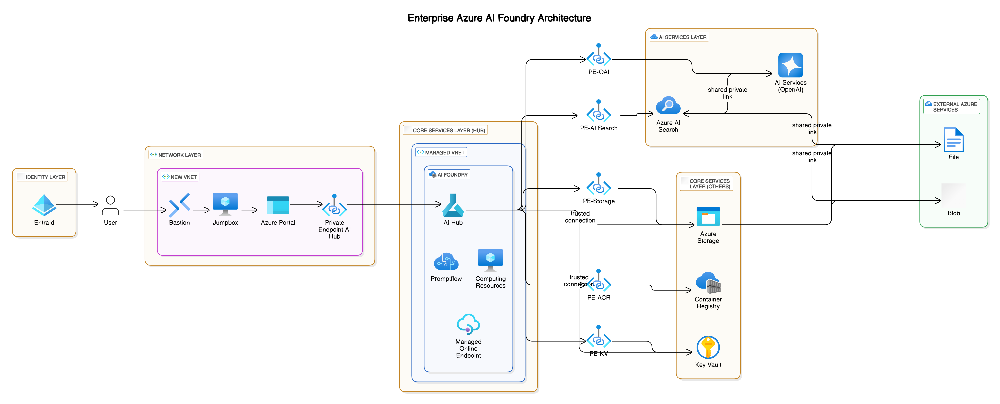

# terraform-azurerm-avm-ptn-ai-foundry-enterprise (in progress)
 


The `terraform-azurerm-avm-ptn-ai-foundry-enterprise` is a comprehensive Terraform module intended for enterprise-scale AI deployments on Microsoft Azure. This module is built to support Azure AI Foundry, an extensive platform that simplifies the creation, management, and scaling of AI-driven applications.

Azure AI Foundry serves as a central hub for managing AI projects, offering tools for building, testing, and deploying AI applications efficiently. It provides robust configuration options, enabling you to manage security, connectivity, and resources through a unified interface.

## Architecture 



This architecture is inspired by the [Azure AI Foundry End-to-End Baseline Architecture](https://github.com/Azure-Samples/aistudio-end-to-end-baseline-architecture/tree/main). For a more detailed deep dive into the security and architecture, please refer to the [Security Deep Dive](https://github.com/Azure-Samples/aistudio-end-to-end-baseline-architecture/blob/main/SECURITY_DEEP_DIVE.md).

## Features

- **Integrated AI Hub**: The AI Hub is a core component of Azure AI Foundry that centralizes project management, enabling collaborative development and efficient resource allocation.
- **Security and Compliance**: Includes network isolation, role-based access control (RBAC), and integration with Azure Key Vault for secure handling of sensitive data.
- **Scalability and Performance**: Designed to handle extensive AI workloads, ensuring robust performance and future growth readiness.
- **Operational Efficiency**: Accelerates deployment through predefined configurations and integrations with Azure services.
- **Networking and Identity Management**: Streamlines deployment of networking and identity resources for efficient access control.
- **Azure Integration**: Seamless integration with Azure services such as Azure Container Registry, Azure Cognitive Services, and Azure Storage.
- **Modular Deployment**: This module allows you to selectively deploy different layers based on your requirements, considering the dependencies between them. Deploying all layers provides an end-to-end solution with security best practices, including network isolation, managed identities, and RBAC access control. Alternatively, you can choose not to deploy the identity layer and customize the example module to fit your needs. Additionally, the entire solution can be deployed into an existing VNET, facilitating seamless integration into an Azure Landing Zones.

## Key Components

### Networking Architecture
- Establishes a secure and scalable network environment utilizing Azure Virtual Network (VNet), Network Security Groups (NSGs), and private DNS zones.

### AI Services
- Integrates advanced AI capabilities including Azure Cognitive Services and Azure Machine Learning for building AI-driven applications.

### Jumpbox Configuration
- Configures a secure Windows-based jumpbox using Azure Bastion for enhanced security and easy administration.

### Identity and Access Management
- Automates RBAC to ensure proper access management across all Azure resources.

### Storage Solutions
- Configures Azure Storage with private endpoints to maintain data integrity and privacy.

### Key Vault Management
- Employs Azure Key Vault for secure management of secrets and sensitive information.

### AI Hub Integration
- AI Hub within Azure AI Foundry provides a centralized management platform for AI projects, allowing for rapid prototyping, building, and deployment of AI solutions. It automates resource orchestration and simplifies security management across AI environments.

## Example Deployment

The following is an example configuration setup that demonstrates how to configure this Terraform module in your Azure environment. Adjust configurations to meet your specific requirements.

```hcl
provider "azurerm" {
  features {}
}

provider "azapi" {}

terraform {
  required_version = ">= 1.3.4"

  required_providers {
    azurerm = {
      source  = "hashicorp/azurerm"
      version = "4.11.0"
    }
    azapi = {
      source  = "azure/azapi"
      version = ">= 2.2.0"
    }
  }

  backend "local" {
    path = "terraform.tfstate"
  }
}

resource "random_id" "short_name" {
  byte_length = 4
}

locals {
  development_environment = true
  base_name               = "${random_id.short_name.hex}${random_id.short_name.dec}"
  location                = "swedencentral"
  tags                    = { "Environment" = "development", "Owner" = "team" }
  
  search_config = {
    private_dns_zone_ids       = []
    tags                       = {}
    sku_name                   = "standard"
    disable_local_auth         = true
    hosting_mode               = "default"
    public_network_access      = "disabled"
    partition_count            = 1
    replica_count              = 1
    semantic_search            = "disabled"
    search_identity_provider   = { type = "None" }
    deploy_shared_private_link = true
    deploy_private_dns_zones   = true
  }

  network = {
    base_name                       = "network-base"
    development_environment         = local.development_environment
    vnet_address_prefix             = "10.0.0.0/16"
    app_gateway_subnet_prefix       = "10.0.1.0/24"
    private_endpoints_subnet_prefix = "10.0.2.0/27"
    agents_subnet_prefix            = "10.0.2.32/27"
    bastion_subnet_prefix           = "10.0.2.64/26"
    jumpbox_subnet_prefix           = "10.0.2.128/28"
    training_subnet_prefix          = "10.0.3.0/24"
    scoring_subnet_prefix           = "10.0.4.0/24"
    app_services_subnet_prefix      = "10.0.5.0/24"
  }
  
  aiservice_config = {
    private_dns_zone_ids     = []
    aiServiceSkuName         = "S0"
    base_name                = local.base_name
    disableLocalAuth         = false
    deploy_private_dns_zones = true
  }
  
  core_config = {
    acr = {
      private_dns_zone_ids   = []
      deploy_acr_private_dns = true
    }
    storage = {
      private_dns_zone_ids       = []
      deploy_storage_private_dns = true
    }
    key_vault = {
      private_dns_zone_ids       = []
      deploy_storage_private_dns = true
    }
    ai_hub = {
      private_dns_zone_ids = []
      tags                 = local.tags
      deploy_private_dns   = true
      description          = "AI Hub"
    }
  }
}

module "complete_infrastructure" {
  source = "../../"
  base_name               = local.base_name
  location                = local.location
  tags                    = local.tags
  development_environment = local.development_environment

  role_templates = {
    infra_admin = [
      { role_name = "contributor", scope = "resource_group_id" },
      { role_name = "azure_ai_administrator", scope = "resource_group_id" },
      { role_name = "search_index_data_contributor", scope = "ai_search_service_id" },
      { role_name = "cognitive_services_openai_user", scope = "openai_embedding_id" },
      { role_name = "cognitive_services_openai_contributor", scope = "openai_chat_id" },
      { role_name = "search_service_contributor", scope = "ai_search_service_id" },
      { role_name = "storage_blob_data_contributor", scope = "storage_account_id" },
      { role_name = "storage_file_data_privileged_contributor", scope = "storage_account_id" }
    ]
    ai_admin = [
      { role_name = "owner", scope = "ai_hub_id" },
      { role_name = "azure_ai_administrator", scope = "resource_group_id" },
      { role_name = "search_index_data_contributor", scope = "ai_search_service_id" },
      { role_name = "search_service_contributor", scope = "ai_search_service_id" },
      { role_name = "cognitive_services_openai_contributor", scope = "openai_chat_id" },
      { role_name = "cognitive_services_openai_user", scope = "openai_embedding_id" },
      { role_name = "storage_blob_data_contributor", scope = "storage_account_id" },
      { role_name = "storage_file_data_privileged_contributor", scope = "storage_account_id" }
    ]
  }

  group_assignments = {
    infra_admin = [
      { type = "user", objectid = "a1234567-89ab-cdef-0123-456789abcdef", name = "Admin User" }
    ]
  }

  deployment_config = {
    deploy_network  = true
    deploy_services = true
    deploy_core     = true
    deploy_identity = true
    deploy_shared   = true
  }

  extra_shared_private_links = []
  extra_ai_hub_outbound_rules = {}
  search_config    = local.search_config
  aiservice_config = local.aiservice_config
  core_config      = local.core_config
}
```

## Requirements

- **Terraform Version**: `>= 1.3.4`
- **AzureRM Provider**: `4.11.0` or later
- **AzAPI Provider**: `Azure/azapi`

This module can be deployed standalone or integrated into an Azure Landing Zone strategy, offering a flexible and secure foundation for AI initiatives on Azure.


## License

MIT License

This README contextualizes the role of the AI Hub within Azure AI Foundry and captures the functionalities as described in the accompanying code segments.
